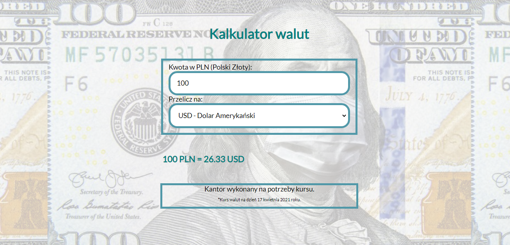

# Currency Exchange 

## Demo version
[Currency Exchange](https://piotrpolinski.github.io/currency-exchange/)

## Used technologies : 
- HTML
- CSS
- BEM
- ES6+ features

## Description
In this project I created a simple currency calculator.The output currency is PLN, which can be converted to :
- USD 
- GBP 
- CHF
- EUR

### Usage

1. Type amount of PLN
2. Select the currency
3. The result will be given immediately

#### Screenshot from app

#### Contanct

aruzac21@gmail.com
